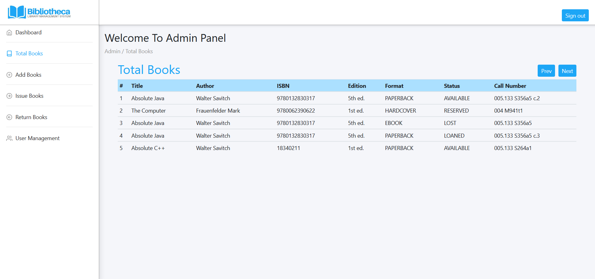
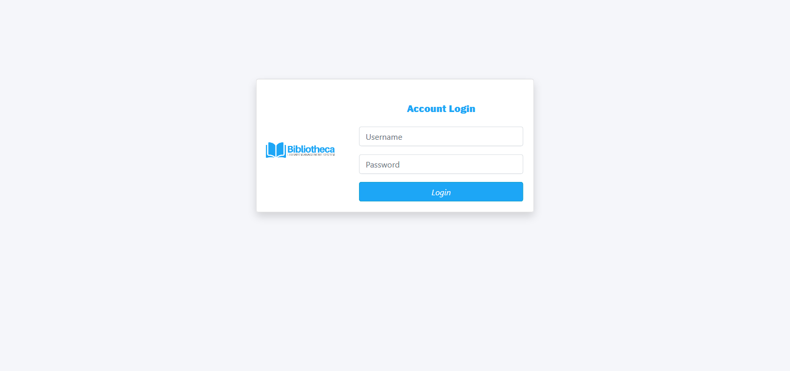

[](https://opensource.org/licenses/MIT)


**Bibliotheca** is an **Integrated Library Management System** for a library to track and manage items owned, orders made, bills paid, and patrons who have borrowed.

## Table of content
- [Demo](#demo)
- [Use Case](#use-case)
- [Database Architecture](#database-architecture)
- [Technologies Used](#technologies-used)
- [Installation](#installation)

## Demo
This demo is for version 1.0.0

### Website

### Admin Dashboard


### Total Books



### Login




## Use Case

We have two main actors in our system:

- **Librarian**: Mainly responsible for adding and modifying books, book items, and users. The Librarian can also issue, reserve, and return book items.
- **Member**:All members can as check-out, reserve, renew, and return a book.


## Database Architecture


## Technologies Used
```
Backend: Spring Boot, PostgreSQL, Java, SQL, Tomcat
Frontend: HTML, CSS, BootStrap, Mustache, Javascript, Chart.js, 
```
## Installation

### Requirements

    - Java 1.8+
    - PostgreSQL 11+
    - Gradle 6+
    
Clone the repository to your local machine 

    git clone https://github.com/Elyorbe/bibliotheca
    
After creating the database, copy ``biblitoheca\db\db_postgresql.sql`` into your SQL editor and run. Or you can run SQL file from the command line as well.
Next, edit ``biblitoheca\db\db_init.sql`` with your own details and do the sam as above.

Then go to ``bibliotheca\conf\`` file and choose your preferred environment file and edit the details of the datasource with your created database credentials.

### Running the application

Execute following command to run the application in the development environment
      
      cd bibliotheca
      gradlew bootRun --args="--spring.profiles.active=dev --spring.config.additional-location=conf\\"
 
